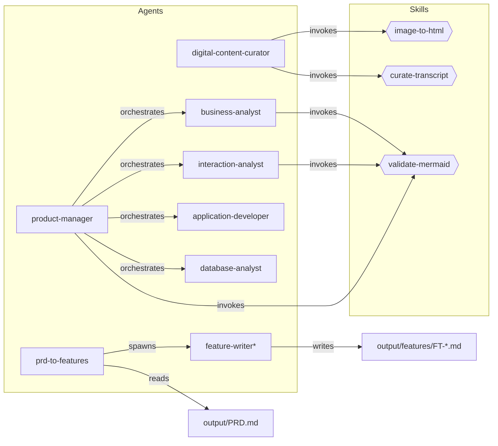
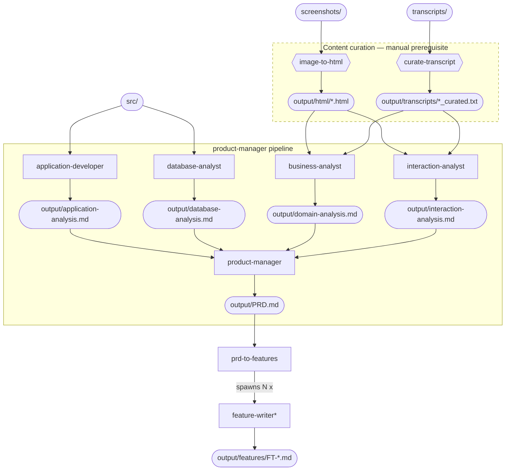

<p align="center">
  
</p>

# Reveng

A lightweight harness around [Claude Code](https://docs.anthropic.com/en/docs/claude-code) for reverse-engineering legacy applications.

## Purpose

Reveng extends Claude Code with specialised tooling and prompts to help engineers understand, document, and modernise legacy systems — regardless of language, framework, or database technology.

## Lineage

Reveng is the successor to [DEFRA/claude-legacy-reveng-plugin](https://github.com/DEFRA/claude-legacy-reveng-plugin), the original exploration of this problem space, which was structured as a Claude Code plugin. This repository supersedes that project: the agents and skills have been rebuilt as a stack-agnostic harness around Claude Code, distributed via a small CLI (`reveng`) rather than the plugin mechanism.

## Permissions

Claude Code prompts for approval before executing tools such as shell commands and file writes. Reveng's CLI commands invoke Claude with `--dangerously-skip-permissions` so they run unattended, bypassing those prompts.

To contain any unintended actions, run reveng commands inside the built-in sandbox. `reveng sandbox` starts a [devcontainer](https://code.claude.com/docs/en/devcontainer) with the `reveng` binary and your workspace mounted; Claude inside the container has no access to anything outside it. See the [`reveng sandbox` workflow](#reveng-sandbox-workflow) below.

```bash
reveng sandbox      # start the sandbox, drops you into a shell
# inside the container:
reveng curate       # ... and run reveng commands from there
```

Running on the host directly (no sandbox) is supported but discouraged. When a reveng command detects it is running outside a sandbox, it prints a loud warning to stderr and asks for interactive confirmation before invoking Claude. In non-interactive contexts (CI, piped input) the warning still prints but the prompt is skipped and the command proceeds.

## Prerequisites

- [Claude Code](https://docs.anthropic.com/en/docs/claude-code) installed and authenticated
- Bash 4+
- `jq` (for parsing Claude output in the `reveng` CLI)
- For the metrics dashboard only: [`uv`](https://docs.astral.sh/uv/) (`curl -LsSf https://astral.sh/uv/install.sh | sh`)
- For `reveng sandbox` only: Docker and the [`devcontainer` CLI](https://github.com/devcontainers/cli) (`npm install -g @devcontainers/cli`)

### Optional: Mermaid validation

The `validate-mermaid` skill (invoked by the `business-analyst`, `interaction-analyst`, and `product-manager` agents to validate Mermaid diagrams in generated outputs) needs one of two validators.

**mermaid-cli (recommended)** — works headlessly and needs no authentication, so it is the validator that works when `reveng` runs non-interactively with an `ANTHROPIC_API_KEY`:

```bash
npm install -g @mermaid-js/mermaid-cli
```

The `reveng sandbox` image ships this preinstalled, along with the `chromium` it renders through, so no setup is needed inside the container.

**Mermaid Chart connector** — an alternative for sessions signed in to claude.ai:

1. Sign in at [claude.ai](https://claude.ai)
2. Open **Settings → Connectors**
3. Enable **Mermaid Chart**
4. Restart Claude Code so it picks up the new MCP server

This is an account-level setting, and the connector is reachable only from claude.ai-authenticated sessions — it is **not** available when running on an API key, which is `reveng`'s default headless mode.

With neither validator available the skill exits cleanly with a notice — the rest of the pipeline still runs, but mermaid diagrams in generated outputs are not auto-validated.

### Optional: run cost tracking

Every Claude invocation appends one row to `.reveng/metrics.jsonl` **in the workspace** (override with `REVENG_METRICS_LOG`) carrying the run id, command, model, cost, duration, turn count, token/cache counts, and the workspace's git branch, short commit and dirty flag. The branch matters because a workspace is often on a per-run branch (`reveng-run-<date>_<model>`), so it is the natural way to attribute spend to an attempt; `dirty` records that uncommitted changes meant the commit alone did not pin the inputs. All three are null where the workspace is not a git repository. The cost record therefore travels with the analysis it justifies. `reveng init` adds `.reveng/` to the workspace `.gitignore`, so committing it is a deliberate act — un-ignore it when you want the spend figures kept as evidence alongside the PRD. Cost comes from Claude Code's own `result` event, so it is already aggregated across every turn and sub-agent — there is no pricing table to keep current.

Each run gets an id of the form `<command>-<model>-<timestamp>` (e.g. `synth-fable-20260821-142233`). Pass `--run-id` to set a stable label when comparing runs:

```bash
reveng synth --run-id synth-fable-baseline -m fable
reveng synth --run-id synth-opus-baseline  -m opus
```

View the dashboard (no install needed) — **run it from the workspace**, since the
log path it defaults to is relative:

```bash
cd /path/to/workspace
uv run --with streamlit --with plotly --with pandas \
  streamlit run ~/.config/reveng/scripts/metrics-dashboard.py
```

The script lives in the config directory (`install.sh` copies it there; from a git
checkout, `scripts/metrics-dashboard.py` works too) but reads `.reveng/metrics.jsonl`
from the current directory. Started from elsewhere it reports that it found no log
rather than silently reading a different one — pre-0.2 logs are not picked up
automatically, because rows written before the run-scope fix can double-count cost.

It plots cost per run, mean cost by command and model, cost per 1k output tokens by model, cumulative spend, cost against output volume, and a per-phase breakdown — `synth` records a separate row per analyst (`/synth/analysis/<agent>`) and one for the PRD (`/synth/prd`).

**Recording controls.** Rows carry no client content — cost, duration, turn count and token counts only — and are capped in size. Because the log lives in the workspace, which always mounts at `/workspace`, rows written inside the sandbox land on the host with no extra bind mount; `reveng sandbox` sets `REVENG_WORKSPACE` from the host folder name so they are still labelled with the engagement rather than `workspace`:

| Variable | Effect |
|----------|--------|
| `REVENG_METRICS=off` | Disable recording entirely |
| `REVENG_METRICS_KEEP=<n>` | Retain only the newest `n` rows (default `5000`) |
| `REVENG_METRICS_LOG=<path>` | Write to one specific file instead of the workspace's `.reveng/metrics.jsonl` — use this to aggregate several engagements into one log |
| `REVENG_METRICS_DIR=<dir>` | Use a directory other than `.reveng` for the log |
| `REVENG_BRANCH=<name>` | Label rows with this branch instead of asking git. Useful in a detached CI checkout, or where git cannot read the workspace |
| `REVENG_WORKSPACE=<name>` | Label rows with this name instead of the current directory's. `reveng sandbox` sets it automatically from the host folder, since the workspace always mounts at `/workspace` inside the container |

The dashboard resolves the same order: `REVENG_METRICS_LOG` if set, else the workspace's `.reveng/metrics.jsonl`, else the pre-0.2 location `~/.config/reveng/metrics/metrics.jsonl` so older logs stay viewable. Run it from the workspace and it finds the right file. To compare engagements, point `REVENG_METRICS_LOG` at a combined file — every row carries `workspace`, so the breakdowns still separate cleanly.

Nothing from `~/.config/reveng` is mounted into the sandbox. Mounting the config directory would expose the installed `plugin/` agents and skills read-write to a container whose Claude runs with `--dangerously-skip-permissions`, which would let an agent inside the sandbox rewrite agents that later run on the host.

**A call that dies before reporting usage records a row with a null cost**, so failures are visible as a count but their spend is unknown — total spend under-counts runs that crashed or were interrupted.

### `reveng synth` options

`synth` runs each analyst as its own Claude session, reusing any analysis file that is already present **and complete** — an analysis missing sections its agent is required to produce is regenerated rather than reused. The four analyses are checked again before the PRD is synthesised.

| Flag | Effect |
|------|--------|
| `--analyses-only` | Run the analysts and stop before the PRD |
| `--prd-only` | Skip the analysts and synthesise the PRD from existing analyses |
| `--force` | Skip every completeness check: reuse existing analyses without validating them, and synthesise the PRD even if they look incomplete. Use it when the checks are wrong about your files — note it also disables the placeholder and minimum-length checks |

`--analyses-only` and `--prd-only` are mutually exclusive.

## Installation

The repository ships with a `reveng` CLI that wraps a set of Claude Code agents and skills in command-driven workflows. See [`specs/reveng-cli.md`](specs/reveng-cli.md) for the full specification.

```bash
git clone https://github.com/marc0der/reveng
cd reveng
./install.sh
```

`install.sh` copies files to:

| Source | Destination |
|--------|------------|
| `reveng` | `~/.local/bin/reveng` |
| `skills/`, `agents/`, `hooks/` | `~/.config/reveng/plugin/` |
| `templates/workspace-CLAUDE.md` | `~/.config/reveng/plugin/CLAUDE.md` |
| `container/Dockerfile`, `container/devcontainer.json` | `~/.config/reveng/container/` |

These files are the source `reveng init` reads from when populating a workspace.

Override the destinations with the `REVENG_BIN_DIR` and `REVENG_CONFIG_DIR` environment variables. `install.sh` refuses to overwrite an existing installation by default — pass `--update` to upgrade in place:

```bash
./install.sh --update
```

**Upgrading an existing workspace.** `reveng init` skips files that already exist, so a workspace initialised against an earlier release keeps its old `.claude/agents/`. Those agents may declare a different set of mandatory sections than the CLI expects, which makes every analysis look incomplete and regenerates all four at full cost. After `./install.sh --update`, refresh the workspace copies:

```bash
cd my-legacy-app
rm -rf .claude/agents .claude/skills
reveng init
```

`reveng synth` warns if it detects this mismatch, naming the agent and both counts.

After installation, verify with:

```bash
reveng version    # prints: reveng 0.2.0
```

If `~/.local/bin` is not already on your `PATH`, add it to your shell profile:

```bash
export PATH="$HOME/.local/bin:$PATH"
```

### Uninstall

There is no dedicated uninstall command. Remove the installed files manually:

```bash
rm ~/.local/bin/reveng
rm -rf ~/.config/reveng
```

## CLI Commands

All `reveng` commands run headlessly — they invoke Claude Code in `--dangerously-skip-permissions` mode. Agents and skills are discovered from the workspace's `.claude/` directory (populated by `reveng init`). When run outside a devcontainer, a warning is printed to stderr and — in an interactive terminal — you are prompted to confirm before Claude is invoked. Use `reveng sandbox` (below) to run commands inside an isolated container.

| Command | Purpose |
|---------|---------|
| `reveng init` | Scaffold `screenshots/`, `transcripts/`, `src/`, `output/`; copy reveng's agents, skills, and a workspace `CLAUDE.md` into the current directory; update `.gitignore` |
| `reveng sandbox` | Start or attach to a devcontainer for the current project (supports `--rebuild` and `clean` subcommand) |
| `reveng curate` | Run the `digital-content-curator` agent to prepare screenshots and transcripts for analysis (default model: `opus`) |
| `reveng synth` | Run the `product-manager` agent to produce `output/PRD.md` from curated content (default model: `opus`) |
| `reveng decompose` | Run the `prd-to-features` agent to decompose `output/PRD.md` into `output/features/FT-*.md` (default model: `opus`) |
| `reveng version` | Print the CLI version and exit |
| `reveng help` | Print usage information |

### Global flags

These flags are accepted by the `curate`, `synth`, and `decompose` commands:

| Flag | Default | Description |
|------|---------|-------------|
| `-m, --model MODEL` | varies by command | Claude model to use |
| `-v, --verbose` | off | Dump Claude's raw stream-json to stderr (debug) |
| `--dry-run` | off | Print the `claude` command that would run without executing it |
| `-h, --help` | | Show command-specific help |

By default, reveng tails Claude's stream-json output and prints a friendly progress stream to stderr — tool calls (e.g. `▸ Read: src/main.py`), assistant text, and a final `✓ Done` line with elapsed time. Pass `-v` to see the raw JSON instead.

### Prerequisites between stages

Each stage validates its inputs before invoking Claude and points the user at the preceding command if something is missing. If the workspace hasn't been initialised at all (no `.claude/agents/`), the command exits with a friendly error pointing at `reveng init`.

| Command | Requires |
|---------|----------|
| `curate` | At least one file in `screenshots/` or `transcripts/` |
| `synth` | At least one `output/html/*.html` and one `output/transcripts/*_curated.txt` (run `reveng curate` first) |
| `decompose` | `output/PRD.md` exists (run `reveng synth` first) |

### `reveng sandbox` workflow

`reveng sandbox` provides a containerised environment so Claude Code can run with `--dangerously-skip-permissions` safely. The container is a Node 20 image with Claude Code and standard dev tools preinstalled, and it mounts the current workspace, the installed `reveng` binary, and (optionally) your SSH keys, GitHub CLI auth, and SSH agent socket. Reveng's agents and skills travel with the workspace via `.claude/`, so no separate plugin mount is needed.

```bash
cd my-legacy-app
git init                    # the sandbox requires a git repository
reveng init                 # scaffold project directories
reveng sandbox              # start or attach to the project's container
# inside the container:
node@sandbox:/workspace$ reveng curate
node@sandbox:/workspace$ reveng synth
node@sandbox:/workspace$ reveng decompose
node@sandbox:/workspace$ exit

reveng sandbox --rebuild    # force a fresh image build
reveng sandbox clean        # remove the project's container
```

## Local Development

Reveng is entirely file-based (Markdown and JSON) — there is no build step. Changes to skills and agents are picked up on the next session start.

### Iterating on agents and skills

After editing files in this repo, propagate the changes to a workspace by re-running `reveng init` there. Existing files at the destination are skipped (to protect local edits), so to refresh a particular agent or skill, delete it from the workspace's `.claude/` first.

```bash
# in the reveng source repo
./install.sh --update         # refresh ~/.config/reveng/plugin/

# in a reveng workspace
rm -rf .claude/agents/business-analyst
reveng init                   # re-copies just the missing agent
```

### Tips

- **Agents** and **skills** are Markdown files — edit and re-init, nothing to compile.
- **Hooks** run shell commands — test them standalone in your terminal before wiring them into `hooks/hooks.json`.
- **MCP servers**, if added later, are the only component that may require a build step.

## Project Structure

```
reveng/
├── reveng                            # The CLI script
├── install.sh                        # Installer
├── skills/<name>/SKILL.md            # Reverse engineering skills
├── agents/<name>/AGENT.md            # Custom subagent definitions
├── hooks/
│   └── hooks.json                    # Hook configuration
├── templates/
│   └── workspace-CLAUDE.md           # Workspace CLAUDE.md shipped by `reveng init`
├── container/                        # Devcontainer used by `reveng sandbox`
├── specs/                            # Specifications
├── CLAUDE.md                         # Conventions for working in this source repo
└── README.md
```

## Input and Output

Place your raw material in the reveng workspace (the directory where you ran `reveng init`) using the directory layout below. Reveng's skills and agents expect these locations.

### Inputs (you provide)

| Directory | Contents |
|-----------|----------|
| `screenshots/` | UI screenshots of the legacy application (`.png`, `.jpg`, `.jpeg`, `.gif`, `.bmp`, `.webp`) |
| `transcripts/` | Stakeholder interview transcripts (`.txt`) |
| `src/` | Legacy application source code — any language, framework, or database stack. The `application-developer` and `database-analyst` agents detect the stack and adapt accordingly. |

### Outputs (generated by reveng)

| Path | Produced by | Description |
|------|------------|-------------|
| `output/html/*.html` | `image-to-html` | Semantic HTML mockup of each screenshot |
| `output/transcripts/*_curated.txt` | `curate-transcript` | Interview transcripts with off-topic content removed (intermediate) |
| `output/domain-analysis.md` | `business-analyst` | Comprehensive domain analysis (ubiquitous language, bounded contexts, subdomains, context map) extracted from curated transcripts and HTML mockups |
| `output/interaction-analysis.md` | `interaction-analyst` | Comprehensive interaction analysis (screen inventory, user workflows with mermaid diagrams, screen navigation map) stitched from HTML mockups and curated transcripts |
| `output/application-analysis.md` | `application-developer` | Comprehensive application analysis (workflows, behaviours, domain model, business rules, reports) extracted from source code |
| `output/database-analysis.md` | `database-analyst` | Comprehensive database analysis (schema, stored procedures, triggers, constraints, database-level business rules) extracted from SQL and source code |
| `output/PRD.md` | `product-manager` | Comprehensive Product Requirements Document synthesised from all analysis outputs |
| `output/features/FT-XXX-*.md` | `prd-to-features` agent | Individual feature specifications decomposed from the PRD, each with user stories, wireframes, and acceptance criteria |

### Output management

Generated outputs are regeneratable artefacts. Recommended version-control approach:

**Commit:**
- `output/PRD.md` — the final deliverable
- `output/features/FT-*.md` — individual feature specifications
- `output/domain-analysis.md`, `output/interaction-analysis.md`, `output/application-analysis.md`, `output/database-analysis.md` — the four analysis files

**Don't commit:** `output/html/` and `output/transcripts/*_curated.txt` are intermediate regeneratable outputs. `reveng init` adds them to `.gitignore` for you.

## Component Map

Rectangles are agents, hexagons are skills. Arrows show invocation relationships.



## Skills

| Skill | Description |
|-------|-------------|
| `image-to-html` | Converts a legacy UI screenshot into semantic, unstyled mockup HTML |
| `curate-transcript` | Removes off-topic content from interview transcripts |
| `validate-mermaid` | Validates all Mermaid diagram blocks in a markdown file and fixes broken diagrams in place |

## Agents

| Agent | Description |
|-------|-------------|
| `digital-content-curator` | Prepares raw screenshots and interview transcripts into structured, analysis-ready outputs (HTML mockups, curated transcripts) |
| `business-analyst` | Extracts strategic DDD patterns (ubiquitous language, bounded contexts, subdomains, context map) from curated transcripts and HTML mockups for PRD generation |
| `interaction-analyst` | Stitches HTML mockups with curated interview transcripts to produce comprehensive interaction analysis (screen inventory, user workflows, screen navigation map) for PRD generation |
| `application-developer` | Comprehensively reads legacy application source code under `src/` to extract workflows, behaviours, domain model, business rules, and reports for PRD generation. Detects the stack and adapts to it |
| `database-analyst` | Comprehensively reads legacy database code under `src/` to extract schema, named routines (stored procedures/functions), triggers, constraints, and database-level business rules for PRD generation. Detects the database technology and adapts to it |
| `product-manager` | Synthesises all analysis outputs (domain, interaction, codebase, database) into a comprehensive Product Requirements Document for implementation planning. Requires curated content as a prerequisite |
| `prd-to-features` | Decomposes a PRD into individually deliverable feature specifications by spawning parallel `feature-writer` agents. Each feature includes user stories, wireframes, acceptance criteria, and effort estimates |
| `feature-writer` *(internal)* | Worker agent spawned by `prd-to-features`. Writes a single feature specification file using the 21-section feature template. Not for direct use. |

## Pipeline

The pipeline has three phases. Content curation is a manual prerequisite — run it first using the `digital-content-curator` agent or the bash script (see Troubleshooting). Once curated content exists, the `product-manager` orchestrates the analysis and synthesis stages to produce the PRD. After reviewing the PRD, run the `prd-to-features` agent to decompose it into individually deliverable feature specifications. In the diagram below, rectangles are agents, hexagons are skills, stadium shapes are files, and the dashed border marks manual phases.



| Stage | Components | Runs in parallel with |
|-------|------------|-----------------------|
| Prerequisite — Content curation (manual) | `image-to-html` and `curate-transcript` skills | Run before launching `product-manager` |
| 1 — Code analysis | `application-developer` and `database-analyst` read `src/` independently | Stage 2 |
| 2 — Content analysis | `business-analyst` and `interaction-analyst` consume curated outputs | Stage 1 |
| 3 — Synthesis | `product-manager` reads all four analyses and writes `output/PRD.md` | None; depends on Stages 1 and 2 |
| 4 — Feature decomposition (manual) | `prd-to-features` agent reads `output/PRD.md` and writes individual feature specs to `output/features/` | Run after reviewing the PRD |

## Troubleshooting

### Content curation stalls on large file sets

The `digital-content-curator` agent processes files sequentially within a single Claude session. When the number of screenshots or transcripts is large (e.g. 50+), the session may exhaust its turn budget before finishing all files.

If this happens, bypass the agent and invoke the skills directly from a bash loop. Each iteration runs its own Claude process with a fresh context window, so there is no turn budget limit. Run this from a workspace that has been initialised with `reveng init`:

```bash
#!/usr/bin/env bash
CLAUDE="claude --model opus --dangerously-skip-permissions"

# Process screenshots
for img in screenshots/*.{png,jpg,jpeg,gif,bmp,webp}; do
  [ -f "$img" ] || continue
  name="${img##*/}"
  name="${name%.*}"
  [ -f "output/html/${name}.html" ] && echo "Skipping $img (already done)" && continue
  echo "Processing $img..."
  $CLAUDE -p "/image-to-html $img" \
    --allowedTools "Read,Write,Bash(mkdir*)"
done

# Process transcripts
for txt in transcripts/*.txt; do
  [ -f "$txt" ] || continue
  [[ "$txt" == *_curated.txt ]] && continue
  name="${txt##*/}"
  name="${name%.txt}"
  [ -f "output/transcripts/${name}_curated.txt" ] && echo "Skipping $txt (already done)" && continue
  echo "Processing $txt..."
  $CLAUDE -p "/curate-transcript $txt" \
    --allowedTools "Read,Edit,Bash(mkdir*;cp*)"
done
```

The skip logic makes this resumable — re-run the script and it picks up where it left off.

## Status

Early development.
